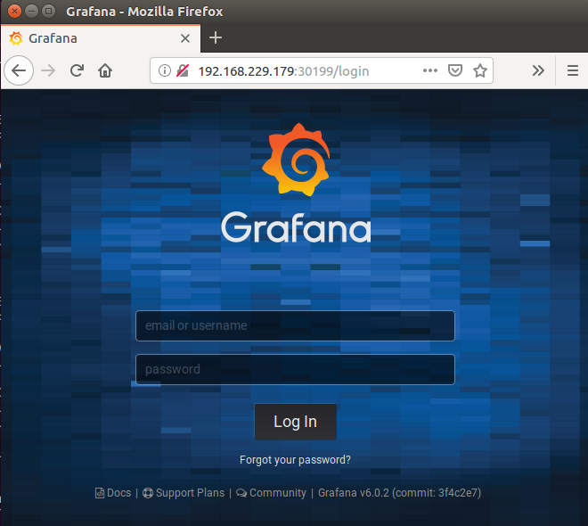
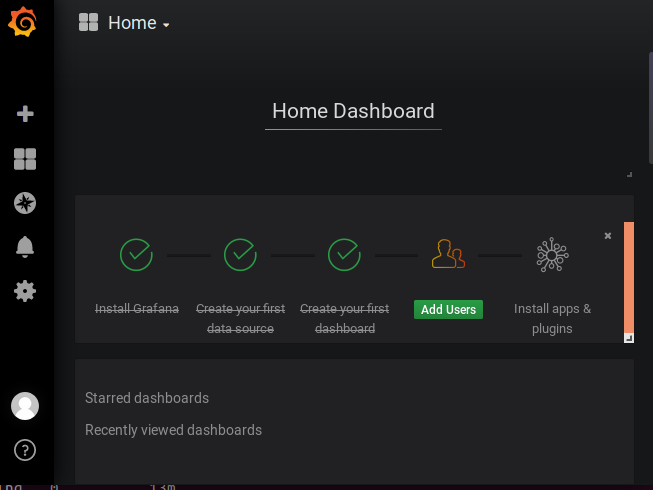
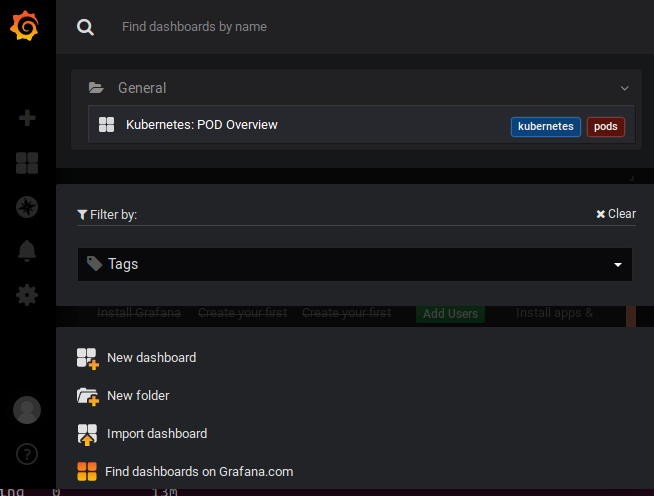
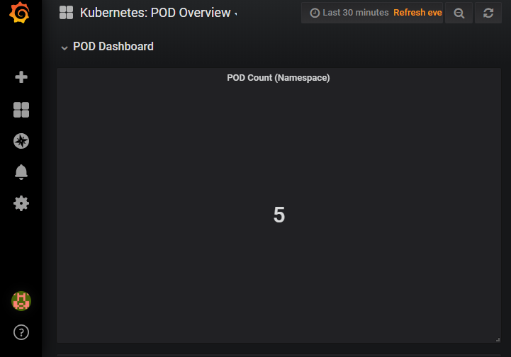

![rx-m LLC][RX-M LLC]


# A Day in the life of a cloud native developer


## Step 06 - Prometheus and Grafana

Prometheus is an open source monitoring and alerting application, often employed to provide application and node-level
metrics monitoring to Cloud Native application deployments. When paired with Grafana, a powerful visualization tool that
meshes well with Promtheus, users are given deep insight into the health of their applications.

Prometheus works by continually collecting, or scraping, open metrics endpoints made available by applications, looking
at any exposed endpoint at /metrics to collect pertinent data. Data can then be sorted inside the Prometheu GUI,
where the user can design queries that can aggregate more useful metrics like averages, sums and histograms.

In this step we'll use helm to deploy Prometheus and other resources needed to monitor applications in K8s.


### 1. Render the Helm Charts

Change into the step06 dir and export your initials/IP namespace name to use with the helm command:

```
ubuntu@ip-172-31-30-5:~/kubecon-eu-2019$ cd step06/

ubuntu@ip-172-31-30-5:~/kubecon-eu-2019/step06$ export INITIALS=wra-172-31-30-5

ubuntu@ip-172-31-30-5:~/kubecon-eu-2019/step06$
```

Now run the helm templates for Prometheus under the step06 directory:

```
ubuntu@labsys:~/kubecon-eu-2019/step06$ helm template ~/kubecon-eu-2019/step06/prometheus/.  \
-f ~/kubecon-eu-2019/step06/prometheus/values.yaml \
--set metadata.namespace=$INITIALS --output-dir ~/kubecon-eu-2019/step06/ --name $INITIALS-metrics

wrote /home/ubuntu/kubecon-eu-2019/step06//prometheus-demo/templates/grafana-secret.yaml
wrote /home/ubuntu/kubecon-eu-2019/step06//prometheus-demo/templates/grafana-dashboard-provider-configMap.yaml
wrote /home/ubuntu/kubecon-eu-2019/step06//prometheus-demo/templates/grafana-datasource-configMap.yaml
wrote /home/ubuntu/kubecon-eu-2019/step06//prometheus-demo/templates/grafana-kubernetes-pod-overview-dashboard-configMap.yaml
wrote /home/ubuntu/kubecon-eu-2019/step06//prometheus-demo/templates/prometheus-configMap.yaml
wrote /home/ubuntu/kubecon-eu-2019/step06//prometheus-demo/templates/prometheus-jmx-exporter-configMap.yaml
wrote /home/ubuntu/kubecon-eu-2019/step06//prometheus-demo/templates/prometheus-serviceAccount.yaml
wrote /home/ubuntu/kubecon-eu-2019/step06//prometheus-demo/templates/prometheus-role.yaml
wrote /home/ubuntu/kubecon-eu-2019/step06//prometheus-demo/templates/prometheus-roleBinding.yaml
wrote /home/ubuntu/kubecon-eu-2019/step06//prometheus-demo/templates/prometheus-service.yaml
wrote /home/ubuntu/kubecon-eu-2019/step06//prometheus-demo/templates/prometheus-deployment.yaml

ubuntu@labsys:~/kubecon-eu-2019/step06$
```

You render the helm chart with the following options:

  - `-f ~/kubecon-eu-2019/step06/prometheus/values.yaml` - uses the values.yaml file found inside the Prometheus Helm chart directory
  - `--set metadata.namespace="$INITIALS"`- Tells Helm to render each manifest with your namespace
  - `--output-dir ~/kubecon-eu-2019/step06/` - Tells Helm to output all manifests inside this directory
  - `--name $INITIALS-metrics` - Names the metrics deployment with your initials suffixed by "-metrics"


### 2. Deploy your Metrics

The previous step creates several static manifests that you can apply to your Kubernetes cluster using `kubectl
apply -f`.

```
ubuntu@ip-172-31-30-5:~/kubecon-eu-2019/step06$ kubectl apply -f ~/kubecon-eu-2019/step06/prometheus-demo/templates

configmap/wra-172-31-30-5-metrics-grafana-dashboard-provider created
configmap/wra-172-31-30-5-metrics-grafana-datasource created
configmap/wra-172-31-30-5-metrics-kubernetes-pod-overview-dashboard created
secret/wra-172-31-30-5-metrics-grafana created
configmap/wra-172-31-30-5-metrics-prometheus-config created
deployment.apps/wra-172-31-30-5-metrics-prometheus created
configmap/wra-172-31-30-5-metrics-prometheus-jmx-exporter created
role.rbac.authorization.k8s.io/wra-172-31-30-5-metrics-prometheus created
rolebinding.rbac.authorization.k8s.io/wra-172-31-30-5-metrics-prometheus created
service/wra-172-31-30-5-metrics-prometheus created
serviceaccount/wra-172-31-30-5-metrics-prometheus created

ubuntu@ip-172-31-30-5:~/kubecon-eu-2019/step06$
```

Once deployed, ensure that the Helm chart elements were deployed successfully using `kubectl get all`:

```
ubuntu@ip-172-31-30-5:~/kubecon-eu-2019/step06$ kubectl get all

NAME                                                      READY   STATUS    RESTARTS   AGE
pod/release-name-ossp-67469746c-4dbjh                     1/1     Running   0          35m
pod/wra-172-31-30-5-metrics-prometheus-66b7bd6568-qqx7p   4/4     Running   0          51s

NAME                                         TYPE           CLUSTER-IP       EXTERNAL-IP                                                                 PORT(S)                         AGE
service/release-name-ossp                    LoadBalancer   10.100.221.157   a446d6c137b7611e98f95020deaa3a09-659563283.eu-central-1.elb.amazonaws.com   50088:30613/TCP                 35m
service/wra-172-31-30-5-metrics-prometheus   NodePort       10.100.52.191    <none>                                                                      9090:31345/TCP,3000:30218/TCP   51s

NAME                                                 DESIRED   CURRENT   UP-TO-DATE   AVAILABLE   AGE
deployment.apps/release-name-ossp                    1         1         1            1           35m
deployment.apps/wra-172-31-30-5-metrics-prometheus   1         1         1            1           51s

NAME                                                            DESIRED   CURRENT   READY   AGE
replicaset.apps/release-name-ossp-67469746c                     1         1         1       35m
replicaset.apps/wra-172-31-30-5-metrics-prometheus-66b7bd6568   1         1         1       51s

ubuntu@ip-172-31-30-5:~/kubecon-eu-2019/step06$
```

Wait a moment while the metrics resources come up and online.


### 3. Accessing Your Metrics

Take a look at the service deployed with your Prometheus Helm chart. It presents four ports numbers in two mappings.
Port 9090 in this example is mapped to 31116, while Port 3000 is mapped to 30199,

```
ubuntu@ip-172-31-30-5:~/kubecon-eu-2019/step06$  kubectl get svc

NAME                                 TYPE           CLUSTER-IP       EXTERNAL-IP                                                                 PORT(S)                         AGE
release-name-ossp                    LoadBalancer   10.100.221.157   a446d6c137b7611e98f95020deaa3a09-659563283.eu-central-1.elb.amazonaws.com   50088:30613/TCP                 36m
wra-172-31-30-5-metrics-prometheus   NodePort       10.100.52.191    <none>                                                                      9090:31345/TCP,3000:30218/TCP   98s

ubuntu@ip-172-31-30-5:~/kubecon-eu-2019/step06$
```

To facilitate access to your metrics, the Prometheus service was set to open a NodePort. This means that you can access
your metrics by entering the external IP address or fully qualified domain name of any node in the cluster combined with
the node port. Accessing a worker node on port 9090 in this example will take you to the Prometheus GUI, while
accessing port 3000 takes you to Grafana.

In a browser, enter one of the IP addresses or FQDNs of the Kubernetes worker machines:

```
ubuntu@ip-172-31-30-5:~/kubecon-eu-2019/step06$ kubectl get node -o wide

NAME                                               STATUS   ROLES    AGE     VERSION   INTERNAL-IP       EXTERNAL-IP      OS-IMAGE         KERNEL-VERSION                CONTAINER-RUNTIME
ip-192-168-104-49.eu-central-1.compute.internal    Ready    <none>   7h40m   v1.12.7   192.168.104.49    35.156.190.95    Amazon Linux 2   4.14.106-97.85.amzn2.x86_64   docker://18.6.1
ip-192-168-117-8.eu-central-1.compute.internal     Ready    <none>   7h40m   v1.12.7   192.168.117.8     35.159.40.214    Amazon Linux 2   4.14.106-97.85.amzn2.x86_64   docker://18.6.1
ip-192-168-141-101.eu-central-1.compute.internal   Ready    <none>   5h14m   v1.12.7   192.168.141.101   18.195.161.16    Amazon Linux 2   4.14.106-97.85.amzn2.x86_64   docker://18.6.1
ip-192-168-142-13.eu-central-1.compute.internal    Ready    <none>   5h14m   v1.12.7   192.168.142.13    54.93.170.136    Amazon Linux 2   4.14.106-97.85.amzn2.x86_64   docker://18.6.1
ip-192-168-158-118.eu-central-1.compute.internal   Ready    <none>   7h40m   v1.12.7   192.168.158.118   54.93.252.48     Amazon Linux 2   4.14.106-97.85.amzn2.x86_64   docker://18.6.1
ip-192-168-170-113.eu-central-1.compute.internal   Ready    <none>   5h14m   v1.12.7   192.168.170.113   3.121.215.120    Amazon Linux 2   4.14.106-97.85.amzn2.x86_64   docker://18.6.1
ip-192-168-198-68.eu-central-1.compute.internal    Ready    <none>   7h40m   v1.12.7   192.168.198.68    18.184.189.118   Amazon Linux 2   4.14.106-97.85.amzn2.x86_64   docker://18.6.1
ip-192-168-244-176.eu-central-1.compute.internal   Ready    <none>   7h40m   v1.12.7   192.168.244.176   3.122.119.152    Amazon Linux 2   4.14.106-97.85.amzn2.x86_64   docker://18.6.1
ip-192-168-249-81.eu-central-1.compute.internal    Ready    <none>   5h14m   v1.12.7   192.168.249.81    18.196.108.25    Amazon Linux 2   4.14.106-97.85.amzn2.x86_64   docker://18.6.1
ip-192-168-99-172.eu-central-1.compute.internal    Ready    <none>   5h14m   v1.12.7   192.168.99.172    3.121.74.226     Amazon Linux 2   4.14.106-97.85.amzn2.x86_64   docker://18.6.1

...

ubuntu@ip-172-31-30-5:~/kubecon-eu-2019/step06$
```



Login to Grafana. The default credentials, which you can set in the Helm chart's Values.yaml file, are as follows:

  - Username: admin
  - Password: kubecon2019eu



Once logged into Grafana, click "Home" to open the Dashboard search. You should see a pre-populated dashboard,
**Kubernetes: POD Overview**:



Select **Kubernetes: POD Overview**:



You will be taken to a very simple dashboard that reports the amount of Pods currently reporting Up status to the
cluster's master Prometheus instance.

Its nice to be able to monitpor things but we are still missing two legs of the observability stool, tracking logs and
tracing calls, let's start by looking at log management with fluentd: [../step07/README.md](../step07/README.md)


<br>

Congratulations, you have completed the tutorial step!

<br>

_Copyright (c) 2019 RX-M LLC, Cloud Native Consulting, all rights reserved_

[RX-M LLC]: http://rx-m.io/rxm-cnc.svg "RX-M LLC"
